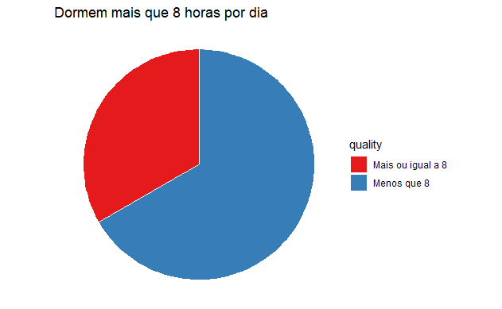
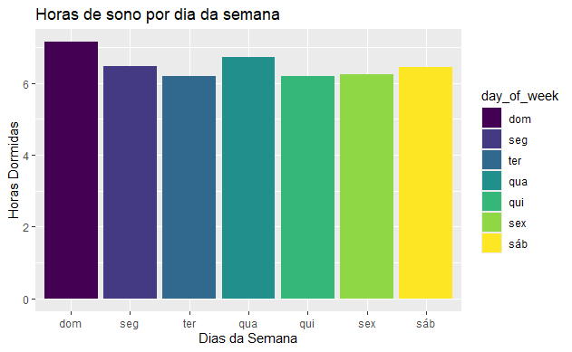
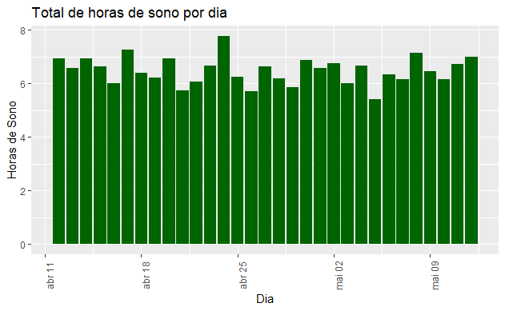
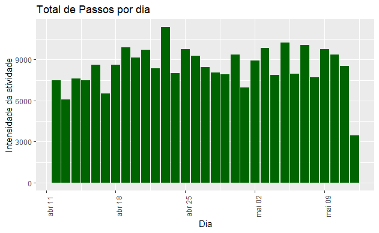
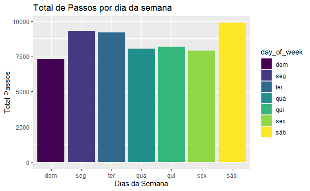
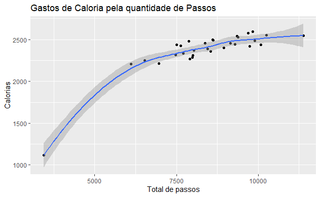
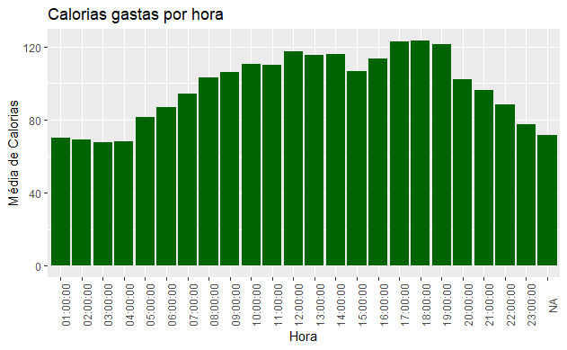
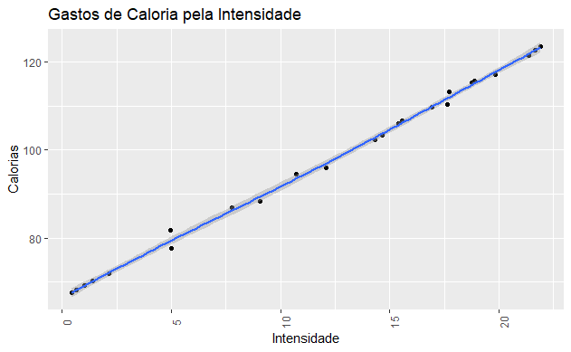

# ESTUDO DE CASO: Comportamento de uso de dispositivos inteligentes Bellabeat
Autor: Douglas Lima

1. [Introdução](#introdução)
2. [Cenário](#cenário)
3. [Personagens e Produtos](#personagens-e-produtos)
4. [Tarefas de Negócio](#tarefa-de-negócios)
5. [Dados](#dados)
6. [Processamento e Exploração](#processamento-e-exploração)
7. [Compartilhamento e percepções](#compartilhamento-e-percepções)
8. [Conclusões](#conclusões)

# Introdução
Este estudo de caso apresenta uma análise detalhada da Bellabeat, uma fabricante de produtos de saúde de alta tecnologia voltados para mulheres. Sob a liderança visionária de Urška Sršen, co-fundadora e CEO, a Bellabeat busca expandir sua presença no mercado global de dispositivos inteligentes. Como parte do curso de Analista de Dados da Google, este estudo se concentra na análise dos dados de condicionamento físico dos dispositivos inteligentes da Bellabeat para identificar padrões de uso e comportamento dos consumidores. As descobertas desta análise fornecerão insights valiosos para orientar as estratégias de marketing da empresa, promovendo seu crescimento e sucesso contínuos no mercado altamente competitivo de tecnologia wearable.

# Cenário

Bellabeat é uma fabricante de produtos de saúde de alta tecnologia voltados para mulheres. Apesar de ser uma empresa pequena, é bem-sucedida e possui potencial para expandir sua participação no mercado global de dispositivos inteligentes.

Urška Sršen, co-fundadora e CEO da Bellabeat, reconhece que a análise de dados de condicionamento físico proveniente de dispositivos inteligentes pode desbloquear novas oportunidades de crescimento para a empresa. Como analista de dados júnior na equipe de marketing, fui encarregado de analisar os dados desses dispositivos para entender melhor como os consumidores os utilizam. Os insights obtidos orientarão a estratégia de marketing da empresa, que será apresentada à equipe executiva da Bellabeat juntamente com recomendações estratégicas.

# Personagens e Produtos

**Personagens**

- **Urška Sršen:** Cofundadora e CEO da Bellabeat
- **Sando Mur:** Matemático e cofundador da Bellabeat; membro-chave da equipe executiva da Bellabeat
- **Equipe de análise de marketing da Bellabeat:** Uma equipe de analistas de dados responsável por coletar, analisar e relatar dados que ajudam a orientar a estratégia de marketing da Bellabeat. Você se juntou a esta equipe há seis meses e tem estado ocupado aprendendo sobre a missão e os objetivos de negócios da Bellabeat – e como você, como analista de dados júnior, também pode ajudar a Bellabeat a alcançá-los.

**Produtos**

- **Aplicativo Bellabeat:** O aplicativo Bellabeat fornece aos usuários dados de saúde relacionados à sua atividade, sono, estresse, ciclo menstrual e hábitos de atenção plena. Esses dados podem ajudar os usuários a entender melhor seus hábitos atuais e tomar decisões saudáveis. O aplicativo Bellabeat se conecta à sua linha de produtos inteligentes de bem-estar.
- **Leaf:** O rastreador de bem-estar clássico da Bellabeat pode ser usado como pulseira, colar ou clipe. O rastreador Leaf se conecta ao aplicativo Bellabeat para rastrear a atividade, o sono e o estresse.
- **Time:** Este relógio de bem-estar combina a aparência atemporal de um relógio clássico com tecnologia inteligente para rastrear a atividade, o sono e o estresse do usuário. O relógio Time se conecta ao aplicativo Bellabeat para fornecer informações sobre seu bem-estar diário.
- **Spring:** Esta é uma garrafa de água que rastreia a ingestão diária de água por meio de tecnologia inteligente para garantir que você esteja adequadamente hidratado ao longo do dia. A garrafa Spring se conecta ao aplicativo Bellabeat para rastrear seus níveis de hidratação.
- **Planos da Bellabeat:** A Bellabeat também oferece aos usuários diferentes planos de assinatura. As assinaturas oferecem aos usuários acesso 24 horas por dia, 7 dias por semana, orientação totalmente personalizada sobre nutrição, atividade, sono, saúde e beleza, além de atenção plena com base em seu estilo de vida e objetivos


# Tarefa de negócios
As perguntas que norteiam a análise são:
1. Quais são algumas das tendências no uso de dispositivos inteligentes?

2. Como essas tendências podem se aplicar aos clientes da Bellabeat?

3. Como essas tendências podem ajudar a influenciar a estratégia de marketing da Bellabeat?

# Dados
Os dados são do Rastreador Fitness FitBit fornecidos por Mobius no Kaggle. A licença deste conjunto de dados confirma que ele é de código aberto e que o autor dedicou este conjunto de dados ao domínio público. Este conjunto de dados é gerado por respondentes de uma pesquisa distribuída via Amazon Mechanical Turk entre 03.12.2016 - 05.12.2016. Trinta usuários elegíveis do Fitbit consentiram em enviar dados pessoais de rastreamento, incluindo saídas em nível de minuto para atividade física, frequência cardíaca e monitoramento do sono. Estaremos observando particularmente o período de 04.12.2016 a 05.12.2016. Estão disponíveis 18 documentos .CSV. Em cada documento, os dados estão organizados em formato longo, com as linhas contendo um ponto temporal por sujeito. Portanto, um sujeito pode ter várias linhas de dados, cada uma contendo um ID único para o usuário, juntamente com diferentes dias e horários. Como há apenas 30 usuários elegíveis do Fitbit incluídos nesses conjuntos de dados, o tamanho da amostra é muito pequeno e nenhuma informação adicional é fornecida sobre cada sujeito. Portanto, existem certas variáveis desconhecidas nesta análise, como idade, altura, peso e nível de atividade de cada sujeito.

# Processamento e Exploração
Para a exploração e análise, utilizou-se a ferramenta Superintendent que nos permite ter uma visualização tabular de dados juntamente com a possibilidade de utilizar SQL para um melhor entendimento dos dados utilizados.

Dentre os 18 apresentados, os datasets que permitiram tirar os melhores insights foram os

    dailyActivity_merged.csv
    sleepDay_merged.csv
    hourlyCalouries_merged.csv
    hourlyIntensities_merged.csv

O arquivo dailyActivity aborda outras bases como:

    dailySteps_merged.csv
    dailyCalouries_merged.csv
    dailyIntensities_merged.csv


Alguns dados não atendiam aos requisitos necessários para se fazer uma boa análise por se tratar de uma amostra muito pequena. Outros, atenderam se quisessem saber mais sobre a rotina dos indivíduos ao longo do dia. Para tanto, os dados escolhidos abordam bem a vida dos indivíduos ao longo do mês permitindo assim tirar conclusões mais assertivas acerca do que foi solicitado para a análise.

### Bibliotecas Utilizadas

```{r}
library(tidyverse)
library(ggplot2)
library(dplyr)
library(tidyr)
library(lubridate)
library(janitor)
```

### Importando Dataset

```{r}
#Mudar projeto para página dos arquivos
setwd("C:\\Users\\user\\OneDrive\\Área de Trabalho\\Estudo de Caso Google\\Fitabase Data 4.12.16-5.12.16")

#Importar datasets
dailyActivity <- read.csv("dailyActivity_merged.csv")
dailySleep <- read.csv("sleepDay_merged.csv")

hourlyCalories <- read.csv("hourlyCalories_merged.csv")
hourlyIntensities <- read.csv("hourlyIntensities_merged.csv")
```

### Familiarização com os Datasets

```{r}
str(dailyActivity)
str(dailySleep)
str(hourlyCalories)
str(hourlyIntensities)
```


Vemos que temos uma inconsitência quanto a data que é apresentada como SleepDay, ActivityDay e ActivityDate. Além disso, os dados de hora e data estão como CHAR então precisamos padronizá-los para o formato correto.

```{r}
dailyActivity <- dailyActivity %>%
  rename(ActivityDay = ActivityDate)
```

```{r}
dailySleep <- dailySleep %>%
  rename(ActivityDay = SleepDay)

head(dailyActivity)
```

### Correção e consistência das colunas de data e hora

```{r}
#Formatação de Data e Hora:

dailyActivity$ActivityDay <- lubridate::mdy(dailyActivity$ActivityDay)
dailySleep$ActivityDay <- lubridate::mdy_hms(dailySleep$ActivityDay)
hourlyCalories$ActivityHour <- lubridate::mdy_hms(hourlyCalories$ActivityHour)
hourlyIntensities$ActivityHour <- lubridate::mdy_hms(hourlyIntensities$ActivityHour)

```

### Limpeza de Dados

Precisamos verificar se os valores do conjuto de dados está ok, ou seja, verificar se não apresenta valores *null* ou duplicados.

```{r}
sum(is.na(dailyActivity))
sum(is.na(dailySleep))
sum(is.na(hourlyCalories))
sum(is.na(hourlyIntensities))
```

```{r}
sum(duplicated(dailyActivity))
sum(duplicated(dailySleep))
sum(duplicated(hourlyCalories))
sum(duplicated(hourlyIntensities))
```

Vemos que somente o dailySleep apresenta duplicatas, então faremos a limpeza.

```{r}
dailySleep <- dailySleep %>%
  distinct() %>%
  drop_na()
```

Também devemos padronizar o nome de todase as colunas, para isso colocaremos todas em snake_case

```{r}
dailyActivity <- dailyActivity %>%
  clean_names()
dailySleep <- dailySleep %>%
  clean_names()
hourlyCalories <- hourlyCalories %>%
  clean_names()
hourlyIntensities <- hourlyIntensities %>%
  clean_names()
```


# Análise

```{r}
#Explorando a quantidade de passos dadas por dia, quantidade de tempo de sendentarismo e a caloria gasta diariamente
s_dailyActivity <- dailyActivity %>%
  select(
    total_steps,
    sedentary_minutes,
    calories,
  )

s_activity_category <- dailyActivity %>%
  select(
    very_active_minutes,
    fairly_active_minutes,
    lightly_active_minutes
    )

s_sleeping <-  dailySleep %>%
  select(
    total_minutes_asleep
  )


s_intensity_hour <-  hourlyIntensities %>%
  select(
    total_intensity,
    average_intensity
  )

summary(s_dailyActivity)
summary(s_activity_category)
summary(s_sleeping)
summary(s_intensity_hour)
```

### Percepções

- A média de passos por dia é de 7.406, com metade desses registros variando entre 0 e 7.600 passos, e apenas 25% dos registros ultrapassando 10.000 passos.

- O tempo médio em atividade é de cerca de 209 minutos, ou 3,5 horas (somando as médias entre muito, médio e pouco ativo), enquanto o tempo médio de sedentarismo é de aproximadamente 1.057 minutos, ou 17 horas.

- 75% dos usuários queimam menos de 2.700 calorias por dia.

- A média de tempo dormindo por dia é de cerca de 430 minutos, ou 7 horas.

### Possibilidades

Com base nessas informações, podemos tentar uma visualização de:

- Quantidade de passos por dia
- Calorias gastas por hora
- Horas dormidas por dia
- Pessoas que dormem 8 ou mais horas por noite
- Total de passos por caloria
- Horas dormidas por dia da semana
- Quantidade de passos por dia da semana
- Intensidade vsm consumo de calorias
- Passos diários vs. gasto de calorias diário


### Mesclagem de tabelas.

Tendo em mente o que queremos, surge a necessidade de mesclar os conjuntos de dados a fim de  integrar os dados complementares, facilitando a análise de relacionamentos entre diferentes variáveis, proporcionando uma compreensão mais profunda dos padrões e tendências. Trabalhar com um dataset unificado torna o processo analítico mais eficiente, eliminando a necessidade de alternar entre múltiplas fontes

```{r}
activity_workout <- merge(hourlyCalories, hourlyIntensities, by=c('id', 'activity_hour'))

daily_data <- merge(dailySleep, dailyActivity, by=c('id', 'activity_day'))
```


### Conversões
```{r}
#Adicionando uma nova tabela que pega os valores em minutos e converte em horas.
daily_data$total_hours_asleep <- daily_data$total_minutes_asleep / 60
daily_data$sedentary_hours <- daily_data$sedentary_minutes / 60

daily_data$total_hours_asleep <- as.integer(daily_data$total_hours_asleep)
daily_data$sedentary_hours <- as.integer(daily_data$sedentary_hours)
```


### Adicionar dia da semana na tabela.

```{r}
activity_workout <- activity_workout %>%
  mutate(day_of_week = wday(activity_workout$activity_hour, label=TRUE))

daily_data <- daily_data %>%
  mutate(day_of_week = wday(daily_data$activity_day, label=TRUE))

#Separate date and time into their own columns for dailySleep
activity_workout <- separate(activity_workout, activity_hour, into=c('activity_day', 'hour'), sep=' ')
```

# Compartilhamento e percepções

### Agrupamento de dados

Também fazer um agrupamento diário dos dados dos usuários, assim sendo possível encontrar uma média diária das atividades em destaque, permitindo assim encontrar tendências para a nossa análise.


```{r}

#Média de Passos por dia
avg_steps_day <- daily_data %>%
  group_by(activity_day) %>%
  summarise(avg_total = mean(total_steps))

#Média de Horas de Sono
avg_sleep_day <- daily_data %>%
  group_by(activity_day) %>%
  summarise(avg_total = mean(total_hours_asleep))

#agrupando os dados para exibir a média de caloria por horas
avg_calories <- activity_workout %>%
  group_by(hour) %>% 
  summarise(avg_total_calories = mean(calories))

#agrupando os dados para exibir a média por horas de intensidade

avg_intensity <- activity_workout %>%
  group_by(hour) %>%
  summarise(avg_total = mean(total_intensity))

#Classificação de acordo com a quantidade de horas dormidas
sleep_hours <- daily_data %>%
  select(total_hours_asleep) %>%
  mutate(quality = case_when(
    total_hours_asleep >= 8 ~ "Mais ou igual a 8",
    total_hours_asleep < 8 ~ "Menos que 8"
  ))

avg_sleep_category <- sleep_hours %>%
  group_by(quality) %>%
  drop_na() %>%
  summarise(total_hours_asleep = mean(total_hours_asleep))


avg_weekday_step <- daily_data %>%
  group_by(day_of_week)%>%
  summarise(avg_total = mean(total_steps))

avg_weekday_sleep <- daily_data %>%
  group_by(day_of_week)%>%
  summarise(avg_total = mean(total_hours_asleep))

avg_intensity_cal <- activity_workout %>%
  group_by(hour) %>%
  summarise(avg_intensity = mean(total_intensity), avg_cal = mean(calories))

avg_steps_cal <- daily_data %>%
  group_by(activity_day) %>%
  summarise(avg_steps = mean(total_steps), avg_cal = mean(calories))
```


### Pessoas que dormem mais que 8 horas diárias



```{r}

ggplot(data = avg_sleep_category, aes(x="", y=quality, fill=quality)) +
  geom_bar(stat="identity", width=1, color="white") +
  coord_polar("y", start=0) +
  theme_void() + 
  theme(legend.position="right") +
  scale_fill_brewer(palette="Set1")+
  labs(title = "Dormem mais que 8 horas por dia")

```

Como mostra o gráfico, menos da metade dos usuário dorme 8 ou mais horas por dias, ou seja, não dorme o recomendado e por isso podem apresentar alguns sintomas referentes as isso como:Dificuldade para manter o foco; Queda do desempenho no trabalho ou nos estudos; Esquecimentos frequentes; Sonolência diurna excessiva; entre outrs.

### Horas de sono por dia da semana



```{r}
  ggplot(data = avg_weekday_sleep, aes(x=day_of_week, y= avg_total, fill= day_of_week))+
  geom_bar(stat="identity", na.rm=TRUE)+
  labs(title = "Horas de sono por dia da semana", x="Dias da Semana", y="Horas Dormidas")
```
O gráfico nos mostra que apesar de não estarem dormindo as 8 horas recomendadas os usuário estão mantendo uma média frequente durando os dias da semana.

### Média de horas de sono por dia



```{r}
ggplot(data=avg_sleep_day, aes(x=activity_day, y=avg_total))+geom_histogram(stat="identity", fill="darkgreen")+
  theme(axis.text.x = element_text(angle=90))+
  labs(title = "Total de horas de sono por dia", y="Horas de Sono", x="Dia")
```
A média de horas que os usuário dormem está acima de 5h por dia.
Vemos que, apesar de alguns picos, em nenhum momento a média atingiu 8 horas diárias de sono que é o recomendado por especialista.

**Recomendação:** O aplicativo pode fornecer recomendações personalizadas para melhorar a qualidade do sono dos usuários que dormem menos de 8 horas. Isso pode incluir dicas de higiene do sono, lembretes para dormir mais cedo e sugestões de relaxamento antes de dormir. Além disso, o Bellabeat pode incentivar os usuários a manter um diário de sono para identificar padrões e fatores que afetam a qualidade do sono.


### Total de Passos por dia


```{r}

ggplot(data=avg_steps_day, aes(x=activity_day, y=avg_total))+geom_histogram(stat="identity", fill="darkgreen")+
  theme(axis.text.x = element_text(angle=90))+
  labs(title = "Total de Passos por dia", y="Intensidade da atividade", x="Dia")
```
A quantidade de passos varia significativamente de um dia para o outro, indicando variações na atividade diária.

Percebe-se que a média de passos diária está acima de 6000 passos.

Alguns dias apresentam picos de atividade, enquanto outros mostram uma redução significativa nos passos.

**Recomendação:** O aplicativo da Bellabeat pode apresentar a meta de passos em 6000 e parabenizá-los quando atingirem picos altos de atividade.

### Total de Passos por dia da semana


```{r}
  ggplot(data = avg_weekday_step, aes(x=day_of_week, y= avg_total, fill= day_of_week))+
  geom_bar(stat="identity", na.rm=TRUE)+
  labs(title = "Total de Passos por dia da semana", x="Dias da Semana", y="Total Passos")
```

Domingo apresenta o menos número de passos, possivelmente pela folga do trabalho ou pelo cansaço de sábado.
Sábado foi o dia com a maior quantidade de passos seguido da segunda-feira. 
A quatidade de passos vai decrescendo a partir da segunda com um alto crescimento no sábado.

**Recomendação:** O aplicativo pode fornecer lembretes e desafios personalizados para aumentar a atividade física nos dias de menor atividade.

### Gasto de Caloria pela quantidade de passos


```{r}
ggplot(data=avg_steps_cal, aes(x=avg_steps, y=avg_cal))+
  geom_point(stat="identity")+
  geom_smooth()+
  labs(title = "Gastos de Caloria pela quantidade de Passos", y="Calorias", x="Total de passos")
```
O gráfico nos mostra um gasto exponencial de caloria até os 7000 passos porém, a partir dai, o gasto calórico vem com um crescimento mais lento.

**Recomendação:** o aplicativo pode incluir uma funcionalidade que rastreia a contagem de passos dos usuários e fornece feedback visual sobre o gasto calórico estimado.

### Calorias gastas por hora


```{r}
ggplot(data=avg_calories, aes(x=hour, y=avg_total_calories))+
  geom_histogram(stat="identity", fill="darkgreen")+
  theme(axis.text.x = element_text(angle=90))+
  labs(title = "Calorias gastas por hora", y="Média de Calorias", x="Hora")
```
Vemos por meio do gráfico que os maiores gastos de caloria estão concentrados entre as 12 horas e as 19 horas.

A partir desse horário vemos um decrescimo do gasto de calórias, podendo ser justificado pelos horários que os usuários estariam indo dormir.

**Recomendação:** O aplicativo da Bellabeat pode apresentar o gasto calorico do indivíduos em alguns horários específicos entre as 12 e as 19. Como também um lembrete, antes desse horário, para as suas atividades de intensidade. 


### Intensidade por hora


```{r}
ggplot(data=avg_intensity, aes(x=hour, y=avg_total, fill=avg_total))+
  geom_histogram(stat="identity")+
  theme(axis.text.x = element_text(angle=90))+
  labs(title = "Intensidade por Hora", y="Média Intensidade", x="Hora")
```
O gráfico de intensidade reforça o que já foi apresentado pelo gráfico de gastos de caloria visto que, como apresentaremos mais a frente, a intensidade está relacionada com o gasto de caloria. Portanto os horários são bem semelhantes. Com aumentos entre 12 horas e 19 horas onde, a partir daí, começa a decrescer.

**Recomendação:** O aplicativo pode fornecer sugestões de atividades ou lembretes personalizados durante os períodos de menor atividade para ajudar os usuários a manterem seus objetivos diários de atividade física.

### Gastos de caloria pela intensidade


```{r}
ggplot(data=avg_intensity_cal, aes(x=avg_intensity, y=avg_cal))+
  geom_point(stat="identity")+
  geom_smooth()+
  theme(axis.text.x = element_text(angle=90))+
  labs(title = "Gastos de Caloria pela Intensidade", y="Calorias", x="Intensidade")
```
O gráfico veio para evidênciar o que foi falado anteriormente. O gasto de caloria apresenta uma correlação positiva com a intensidade, ou seja, quanto maior a intensidade maior será o gasto calórico.

# Conclusões

### Resultados

- A média de passos diários dos usuários esta por volta de 3000 passos. Então trabalhar com valor para meta diária de passos - pode ser uma boa opção.
 
- Em média, os usuários não tem uma boa qualidade de sono visto que domem menos que 8 horas diárias.
 
- Há picos de intensidade entre os horários de 12 às 19 hora, - indicando períodos de maior atividade.
 
- Levando os gráficos em consideração, o dia da semana com maior intensidade/atividade seria o sábado entre as 12h e as 19h.
 
- Foi identificada uma correlação positiva entre a quantidade de passos e o gasto de caloria.

### Recomendações para os aplicativos da Bellabeat
Forncer sugestões de atividades e lembretes personalizados durante os períodos de menor atividade para ajudar os usuários a manterem seus objetivos diários de atividade.

Fornecer recomendações personalizadas para melhorar a qualidade do sono dos usuários que dormem menos de 8 horas. Isso pode incluir dicas de higiene do sono, lembretes para dormir mais cedo e sugestões de relaxamento antes de dormir.

Estabelecer metas semanais baseadas nos dias da semana para incentivar os usuários a manterem uma consistência nas suas atividades.

Oferecer mensagens motivacionais ou recompensas após alcançar certos marcos durante os dias menos ativos (domingo a terça-feira) para aumentar os níveis de atividade ao longo da semana.

Incluir uma funcionalidade que rastreia a contagem de passos dos usuários juntamente com o gasto calório estimado pela quantidade de passos.

Implementar recursos de definição de metas onde os usuários podem definir alvos diários de passos e receber notificações ou recompensas ao alcançá-los.


### Estratégias de marketing
Incentivar os usuário a fornecerem seus dados a Bellabeat a fim de obter mais variáveis e uma amostra de dados maior para uma análises mais precisa;

Criar campanhas educativas para os usuários sobre a importância da atividade física regular e de um sono de qualidade. Podendo utilizar dados e insights dos gráficos para mostrar como o Bellabeat pode ajudar a monitorar e melhorar esses aspectos.

Compartilhar histórias de sucesso de usuários que alcançaram suas metas de saúde e bem-estar usando o Bellabeat.

Gamificar os desafios semanais, organizando desafios semanais com metas específicas onde usuários podem competir para ganhar pontos. Além disso, nutrir a comunidade de usuário promovendo atividade em grupo, assim, fortalecendo o laço da marca com a comunidade de usuários.

Estabelecer parcerias com academias, estúdios de ioga e outras empresas de bem-estar para oferecer pacotes combinados ou descontos para os usuários do Bellabeat.

Coletar feedback dos usuários sobre suas experiências com o Bellabeat e usar essas informações para melhorar continuamente o aplicativo. Implementar novas funcionalidades com base nas necessidades e preferências dos usuários.

Oferecer um excelente suporte ao cliente para ajudar os usuários a resolverem quaisquer problemas que possam encontrar e garantir uma experiência positiva com o aplicativo.

Ao implementar essas estratégias de marketing, o Bellabeat pode aumentar a conscientização sobre a importância da atividade física e do sono, engajar os usuários de maneira mais eficaz e promover um estilo de vida saudável e equilibrado. Essas estratégias também ajudarão a fortalecer a marca Bellabeat e a fidelizar os usuários existentes, ao mesmo tempo em que atraem novos usuários para a plataforma.